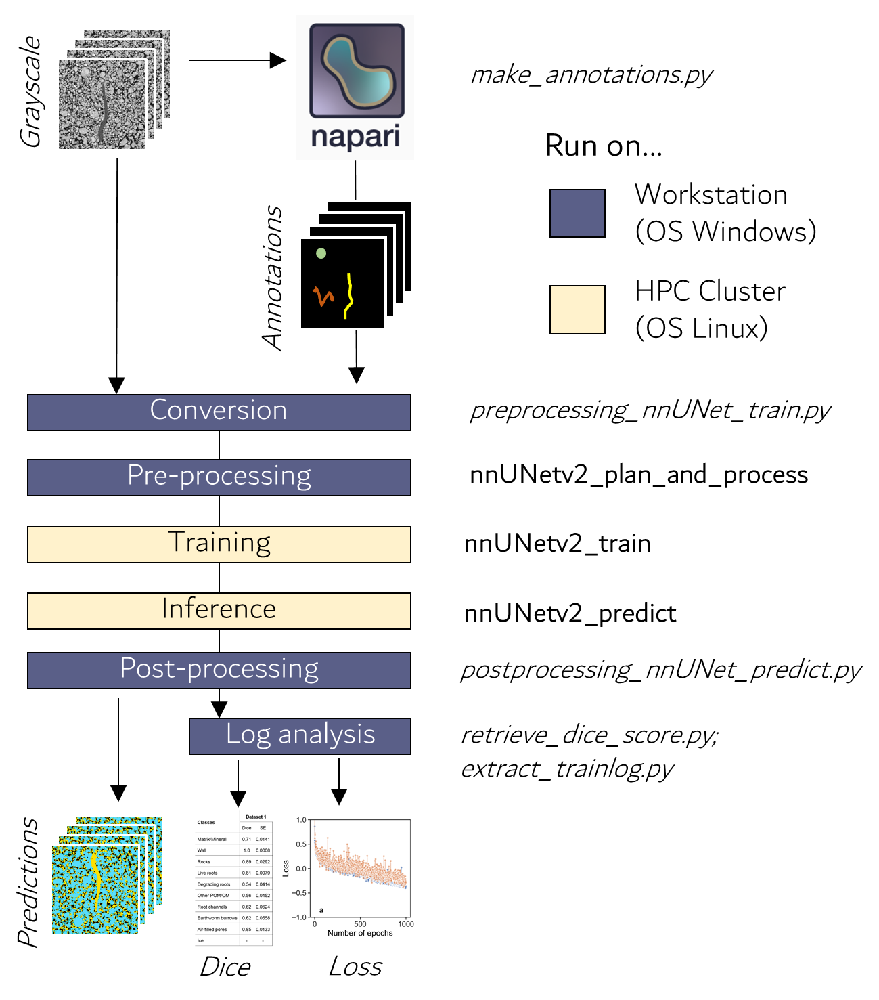

# Welcome
This repository contains the code and documentation to run the complete nnUNet pipeline on 3D X-ray CT images of soil samples. It was developed in the framework of a collaboration between the Department of Soil System Sciences of the [Helmholtz Center for Environmental Research](https://www.ufz.de/) (UFZ) and the Applied Computer Vision Lab of [Helmholtz Imaging](https://www.helmholtz-imaging.de/). The main purpose of the collaboration was to promote and ease the adoption of deep learning for image segmentation tasks in soil science, with a focus on 3D X-ray CT images. Our contribution is three-fold, i.e., we developed:  
1. a new methodology to efficiently label images in order to obtain ground-truth annotations;
2. several scripts to prepare the input images to a format that is compatible with nnUNet;
3. extra utilities for result extraction. 

In this repository, we provide detailed explanations on how to transition from 3D image stacks to nnUNet predictions. If you used this repository and associated code for your own work, please cite the references, institutional links, and tooling documentation listed in **[`RESOURCES.md`](RESOURCES.md)** to acknowledge our efforts.

# Philosopy
The scripts and repository were written assuming (almost) no prerequisite programming experience of the user. Together, we will go in detail into a range of technical aspects, from installing plugins to tapping into the resources of high performance computing (HPC) cluster. We aimed to write codes which are flexible and easy to use. For most scripts, you will have to adjust a few file paths only. In most cases, these filepaths are given from the terminals. We hope that this philosophy and the level of details of this document will help you get onto the deep learning boat for your image processing tasks.

<!-- We are aware that the fluidity of the code could have been improved. On some occasions even, a few file format conversion are superfluous. On purpose, we chose to go for redundancy instead of modifying the native code of nnUNet. -->

# Glossary
Before getting down to business, let´s define a few terms to avoid potential confusion. 
- Dataset: collection of all images and annotation
- Image: one single (.tif, .mha or .nii.gz) file which contains the grayscale values
- Class: a category present in the images, e.g., for instance "roots", "soil matrix" or "biopores" 
- Label: the specific value assigned in the segmentation mask, e.g., 1 = Roots; 2= Soil matrix; 3 = Biopores
- Annotation: one single (.tif, .mha or .nii.gz) file which contains the labelled classes - Created by you
- Prediction: one single (.tif, .mha or .nii.gz) file which contains the labelled classes - Created by nnUNet
- Mask: a separate image that defines which voxels belong to specific classes (or labels). Masks can be binary if only background and foregound are of intestest or grayscale for multiclass segmentation. Essentially, an annotation file is also a mask and both words can be used interchangeably in this documentation.  
- Image crops: an image that was cropped from a bigger image (in terms of size). "Subvolumes" or "cutouts" are synonims of "image crops". 

# Workflow
Our workflow includes several crucial steps such as image annotation, conversion, preprocessing, model training, inference and analysis of the output data (Figure 1). The workflow was mainly developed in Python. It uses several scripts (steps in italic font on figure 1) that create annotations and convert the images to nnUNet-friendly formats, before processing using the native nnUNet pipeline (steps in bold font on figure 1). 

## Quick prediction inspection in Napari (single volume)
Use the standalone script `inspect_predictions.py` to visually compare one prediction volume with its original volume in Napari.

Supported input formats: `.nii`, `.nii.gz`, `.tif`, `.tiff`, `.mha`.

Command (local):
````shell
C:/Users/ronys/miniconda3/envs/venv-napari/python.exe inspect_predictions.py --prediction_volume /path/to/prediction.nii.gz --original_volume /path/to/original.tif
````

Optional flags:
- `--prediction_opacity 0.5` to control overlay opacity.
- `--hide_prediction` to start with prediction hidden.

<p align="center">
   
</p>

**Figure 1.** Workflow to transition from 3D X-ray CT image stacks to nnUNet predictions 

Our workflow relies on the use of HPC cluster to perform computionnally demanding tasks such as training and inference. We highly recommend you do the same because GPUs are so much faster than CPUs. Also, we developed this workflow in a way that several GPUs can work in parallel on several cutouts of the same image. This feature allows increased processing speed, which makes it highly competitive, even against less computationally demanding segmentation methods. 

If your university or research institution does not offer access to a HPC cluster, consider relying on dedicated GPU Servers that can be rented. For processing tasks that rely on CPUs only, we recommend using a regular workstation. Here, we used a workstation running on Windows (64-bit, Intel(R) Xeon(R) Gold 6142 CPU and 192 GB RAM) for CPU tasks only. For GPU tasks only, we used the [EVE cluster](https://www.ufz.de/index.php?en=51499). The EVE cluster is a HPC cluster maintained by the UFZ and which hosts several NVIDIA A100. 

# 1.  Provide dataset information
The first step of the workflow is to provide some parameters and informations in the ```dataset_info.json``` file. In this file, set the TaskID as any three digit number of your choice, choose a meaningul name for your dataset and a normalization method (more on that later in the documentation, for now you can leave it as is). Set the labels according to the classes of interest that you want to segment. Finally, set a RGB code that defines how each class will be displayed during the annotation of your images. Below, we show the class definition that we used for the Dataset 1 (see our [publication](https://doi.org/10.22541/essoar.173395846.68597189/v1) for more information).

````python 
{   "TaskID": 777, 
    "DatasetName": "GCEF", 
    "norm_type": "noNorm", 
    "labels": { 
        "0": "ToPredict",
        "1": "Matrix",
        "2": "Wall",
        "3": "Rocks",
        "4": "FreshRoots",
        "5": "DegradingRoots",
        "6": "otherPOM",
        "7": "RootChannels",
        "8": "EarthwormBurrows",
        "9": "otherPores"
    },
    "colors": { 
        "0": [0, 0, 0],
        "1": [115, 0, 102],
        "2": [51, 51, 51],
        "3": [255, 255, 0],
        "4": [204, 0, 0],
        "5": [255, 153, 51],
        "6": [204, 255, 255],
        "7": [11, 0, 255],
        "8": [51, 204, 0],
        "9": [0, 122, 153]
    }
}
````
It is important to note that the label "0" should always be the class "ToPredict" (i.e., not annotated). Once this is done, we can start preparing some ground truth data.

# 2.  Ground truth data preparation 
## 2.1. Setting up your computer 
### 2.1.1. Install Miniforge 
Miniforge is a lightweight version of Anaconda that helps install and manage Python and other software packages efficiently. It is designed for flexibility and supports open-source package management with Conda, making it ideal for scientific computing and data analysis. We recommend the distribution [Miniforge](https://github.com/conda-forge/miniforge#miniforge3). For ease-of-use, it is recommended to install it for your use only and not add Conda to the PATH variable during installation.

### 2.1.2. Create a virtual environment <!-- Successful on BOPHY116 -->
When working with Python, we often rely on various plugins and software libraries that need to be well-organized. One effective way to manage them is by using Conda environments. A Conda environment functions like a virtual workspace or isolated system, accessible through the terminal. Software installed within one Conda environment remains separate and may not be available in others. Please use the following command in your Miniforge terminal to create a virtual environment.
````shell
mamba create -n venv-napari python=3.11
````
If you wish, replace "venv-napari" by any name you want to give to your virtual environment. Choose a name that is meaningful and easy to remember as you are likely to use it often.  Make sure to activate your virtual environment before proceeding with further installations:
````shell
mamba activate venv-napari
````
Then set your working directory to the folder containing the python scripts of this repository.

````shell
cd /path/to/the/folder/nnUNet4SoilXrayCT
````

### 2.1.3. Install devbio-napari <!-- Successful on BOPHY116 -->
Napari is an open-source tool for viewing and analyzing large 2D and 3D images, commonly used in scientific research. It provides an interactive, user-friendly interface for exploring image data, making annotations, and applying analysis techniques. What we love so much about Napari is that it is scriptable which makes it really easy to work with. We recommend devbio-napari, a distribution of [Napari](https://github.com/haesleinhuepf/devbio-napari) with a set of plugins for bioimage analysis. In our workflow, we used Napari to annotate images. Use the following command in your Miniforge terminal to install devbio-napari.
````shell
mamba install devbio-napari pyqt -c conda-forge
````
## 2.2. Image selection
To create representative ground truth datasets, it is important to select subvolumes that contain the classes of interests (defined previously in ``dataset_info.json``). Due to the spatial and temporal heterogeneity of soil constituents, it is unlikely that all classes will be present within one single image. Therefore, we recommend selecting subvolumes so that all classes of interests are present in the whole training datasets at least once (but they can be absent in some images). We recommend preparing image cutouts having the same x-y extent as the original image but only 300 slices in the z-direction. This allows to work with small images while still capturing classes of interests representatively.

**IMPORTANT**: The selected images for ground truth generation should be in a 3D .tif file format.  

## 2.3. Image annotation
For image annotation, we developed a strategy that minimizes annotation efforts while still ensuring that all relevant classes are captured. This strategy relies on dense annotations of one slice and on sparse annotations for other interesting classes within a stack (see figure 2 in our [publication](https://doi.org/10.22541/essoar.173395846.68597189/v1)). To perform dense annotations, the middle slice of the stack is segmented with Otsu thresholding to isolate the soil matrix and it is manually annotated for the other classes. 

To do so in a semi-automatic manner, we created the `make_annotations.py` script. This script takes three arguments, i.e., the input folder path (the path to the folder containing the images that you want to annotate), the output folder path (the path to the folder where the annotations will be saved; if the folder does not exists, it will be created automatically) and the sample ID (the name of your 3D tif image, without its extension). These arguments are passed from the command terminal with three flags, i.e., "-i", "-o" and "-id", respectively.   

````shell
python make_annotations.py -i /path/to/the/images/to/annotate -o /path/to/where/annotations/will_be/saved -id sample_ID
# Example
python make_annotations.py -i C:\Users\phalempi\Desktop\images -o C:\Users\phalempi\Desktop\annotations -id SPP_P21_SPE_UC193
````
Just a short moment after launching the script, the GUI of Napari pops up and displays the middle slice of the loaded image. On that middle slice, the soil matrix appears in color (for us 115,  0, 102 in RGB code). Note that if annotations are present in the output folder (because you saved but did not finish annotating one image), the previous annotations will be loaded automatically. 

To get familiar with the GUI of Napari, we recommend consulting external resources. There are some very good explanatory videos out there (for instance on YouTube) that show how to efficiently annotate images with Napari. Because a short video is more impactful than thousand words, we won´t go over the procedure in this repository. Note that with the current version of nnUNet at least five annotated images are needed. In all cases, we discourage using less than five annotated images.

Once you are done annotating your images, close the Napari GUI and the annotated images will be automatically saved. Currently, annotations are automatically saved and previous annotations are overwritten. If this behavior is not desirable for you, you can give an extra argument with the flag "-write". If the value 'no' is used, the annotations will not be saved. Before going further with data preparation, make sure to deactivate the current virtual environment.

````shell
mamba deactivate
````
# 3. Data preparation 
## 3.1. Setting up your computer 
### 3.1.1. Create a virtual environment <!-- Successful on BOPHY116 -->
Unfortunately, devbio-napari and nnUNet cannot be installed in the same virtual environment because of conflicts between version packages. This means that we need to install another virtual environment to work with nnUNet. We can create a virtual environment and activate with a single command line as follows: 
````shell
mamba create -n venv-nnunet python=3.11 && conda activate venv-nnunet
````
### 3.1.2. Install git <!-- Successful on BOPHY116 -->
Git is a version control system that helps track changes in code and collaborate on projects. Git can also be used to download code as it allows users to clone repositories from remote servers (e.g., GitHub, GitLab, Bitbucket). Here, we are using git to download the nnUNet repository from GitHub. To install git, type the following command in your terminal.
````shell
mamba install git
````
### 3.1.3. Install nnUNet <!-- Successful on BOPHY116 -->
nnUNet is a self-configuring deep learning framework for medical image segmentation. It automatically adapts to new datasets by optimizing preprocessing, network architecture, and training settings, making it a powerful and user-friendly tool for segmentation tasks. More information on nnUNet can be found [here](https://github.com/MIC-DKFZ/nnUNet/blob/master/documentation/installation_instructions.md#installation-instructions). To install nnUNet, enter the following commands: 
````shell
git clone https://github.com/MIC-DKFZ/nnUNet.git
cd nnUNet
pip3 install -e .
````
After installing nnUNet, create some folders named "nnUNet_raw" and "nnUNet_preprocessed". After creating the folders, set them as environmental variables using the following commands in your Miniforge
terminal: 
````shell
set nnUNet_raw = your/path/to/nnUNet_raw
set nnUNet_preprocessed = your/path/to/nnUNet_preprocessed
````

### 3.1.4. Download ImageJ <!-- Successful on BOPHY116 -->
ImageJ is a free, open-source image processing software widely used in scientific research. In our workflow, we used ImageJ to convert the input images to a nnUNet-friendly format. You can download ImageJ (Fiji) from [here](https://imagej.net/software/fiji/downloads#other-downloads).

### 3.1.5. Download the files from this repository and place them in appropriate folders 
1. Put the imageJ macros (files ending with .ijm) into the macros folder in the Fiji app (at .../Fiji.app/macros).
   
   **For Windows**: The files are convert_mha_to_img.ijm, convert_nii_to_mha.ijm and convert_tif_to_mha.ijm.
   
   **For Ubuntu**: convert_mha_to_img_ubuntu.ijm, convert_nii_to_mha_ubuntu.ijm.
    If the Ubuntu scripts are used, remove the "_ubuntu" sufices in the filenames.
3. Put 03_training/nnUNetTrainer_betterIgnoreSampling.py into nnunet/nnunetv2/training/nnUNetTrainer/variants/sampling/
4. Place nifti_io.jar (currently in ./nnUNetX4SoilXrayCT/Utilities) into the plugins folder of ImageJ (at ../Fiji.app/plugins").
   
### 2.1.6. Setting file paths
Open the \_\_path__.py file (from this repository) with a text editor and adapt the paths according to your local installations. You have to define the four following paths: 
1) the path to your ImageJ application
2) the path to the nnUNet_raw folder (same as you set as an environment variable during the nnUNet installation)
3) the path to the images of your training data (input_dir_images) # IMPORTANT: images should be in 3D stack .tif format
4) the path to your annotations (input_dir_masks) # IMPORTANT: annotations should already be in 3D stack .tif format if you used `make_annotations.py` to generate the annotations

## 3.2. Data conversion
This step takes the image and annotation files from two given folders, processes them and saves them as .nii.gz in the nnUNet_raw folder. Here, you have to keep in mind that our workflow works in a "folder-based" manner. This means that all images should be in one folder and all annotations should be in another one. 

Data conversion entails converting the input files to .nii.gz, handling the ignore label in the annotations, cropping images and annotations to the relevant parts, normalizing the image crops and putting everything into the nnUNet format (adhering to nnUNets naming conventions of folders and files). During this step, data is normalized according to three possible methods:

- *noNorm*: no normalization is done
- *zscore*: normalize by mean and std: ```(img - mean) / std``` (this is the nnUNet default method)
- *rescale_to_0_1*: rescale the values to the range of 0 and 1: ```(img-min)/(max-min)```
<!-- - *rgb_to_0_1*: Just divide by 255: ```img/255```  Removing that one as it is not applicable to grayscale CT -->

You can set the appropriate method in the ```dataset_info.json``` file. Once this is done, start converting your data by running:
````shell
python 02_preprocessing/nnunet/preprocessing_nnUNet_train.py
````
<!-- Notes for me: This step takes roughly 7 minutes for an image of 3G on BOPHY116 --> 

## 3.3. Preprocessing and planing
The preprocessing and experiment planing are default steps in the native nnUNet pipeline. These steps use the data from nnUNet_raw, processe them and save them in the nnUNet_preprocessed folder. Depending on your data, this can take a while and consume a lot of RAM. You can run the preprocessing with the following command.

````shell
nnUNetv2_plan_and_preprocess -d <TaskID> -c 3d_fullres -np <num.processes> -npfp <num.processes>
# Example
nnUNetv2_plan_and_preprocess -d 777 -c 3d_fullres -np 4 -npfp 4
````
The TaskID parameter is the one you defined in ``dataset_info.json``. The -np and -npfp parameters define how many processes are used during the preprocessing.  A higher number means that the preprocessing is faster but more RAM is consumed, while lower numbers mean that less RAM is needed but the processing takes longer. You can play around with these parameters; for us 4 worked well. Now that your data abides to the nnUNet format and are preprocessed, the training process can start. But first, let´s have a few words on HPC clusters.

# 4. High Performance Computer cluster
## 4.1. Introduction
Let´s briefly describe what HPC clusters are to put everyone on the same level. An HPC cluster is a system made up of multiple interconnected computers (often called nodes) that work together to perform complex computations. These clusters are designed to handle tasks that require a large amount of computational power, such as scientific simulations, data analysis, machine learning, or rendering. Most HPC clusters run on Linux due to its stability, scalability, and open-source nature. HPC clusters typically use a job scheduler (like SLURM) to allocate resources and manage the execution of computational tasks across the nodes. For the rest of this example, we will assume that you also dispose of a cluster running on Linux with a SLURM job scheduler (this is actually the case for many of the HPC clusters out there).

## 4.2. Connecting to your HPC Cluster
How you connect to your HPC Cluster mostly depends on the infrastructure and softwares available in your university or research institution. At the UFZ, we use softwares with GUIs, although we are aware that SSH connection is usually more convenient. For this, we use FileZilla to transfer local files to a remote server. We also use X2GO client to connect to the head node of the cluster and send jobs across the cluster. We recommend that you contact your IT administrator to figure out what is the easiest solution for you. In the following, we will assume that you got these steps right and that you could successfully connect to your HPC Cluster.

## 4.3. Storing data on your cluster
There are several locations on which data can be stored on a HPC cluster. The appropriate location depends on the filetype and their expected lifetime. It is good practice to keep softwares, virtual environments, scripts and git repositories on the /home folder. The /work folder is suited to store the output of jobs and it has therefore a high disk quota, however the file lifetime can be limited. To store data which should be kept for longer period of times (i.e., trained models or grayscale data), the /data directory is approriate. 

Note that not all HPC clusters have exactly the same directory structure and nomenclature, but many follow a similar convention like the aforementionned one. Here again, contact your IT administrator to find out the best data storage options for your data. 

## 4.4. Requesting resources from your HPC Cluster
While requesting resources from your cluster, you have to bear in mind a few aspects. One of the most important one is the maximum runtime of jobs. It specifies a time limit that a running job cannot exceed. If the job exceeds the requested time, it will be killed automatically by the scheduler. The same applies for the requested memory per cpu. It is a good practice to optimize these parameters to avoid exceeding the job requirements, but to keep them as low as possible so that the scheduler grants resources quicker. 

<!-- FOR UFZ Users: Note also that GPU Nodes only have a maximum of 470GB RAM available. This means that the total amount of RAM (calculated as cpus-per-task * mem-per-cpu) has to be inferior to 470GB -->  

## 4.5. Setting up your HPC Cluster
### 4.5.1. Setting  up a virtual environment
Because we are now physically using another computer (the cluster), we have to create (again) a new virtual environment for nnUNet. Since the cluster runs on Linux OS, the command to create a virtual environment slightly differ. Here is an example:

````shell
python -m venv /home/username/venv-nnunet
````
where "username" is your login name and "venv-nnunet" is the name of your virtual environment. Here we used venv-nnunet to be consistent with the previous naming.

Then activate the virtual environment with the following command: 
````shell
source /home/username/venv-nnunet/bin/activate
````
### 4.5.2. Install PyTorch
Once your virtual environment is created, you can install PyTorch. PyTorch is an open-source machine learning library for Python, widely used for deep learning and artificial intelligence. It provides flexible tools for building, training, and deploying neural networks, with strong support for GPUs and dynamic computation graphs. To install PyTorch, enter the following command: 
````
pip3 install torch torchvision torchaudio --index-url https://download.pytorch.org/whl/cu117

> See `RESOURCES.md` for the full list of PyTorch wheel indices used across this repo (cu117 here, cu124 for the GPU preprocessing branch).
````
Note that, here, we install an older PyTorch version (compatible with the CUDA platform 11.7). More recent versions of CUDA are currently available, however we have not yet tried them on our cluster.

### 4.5.3. Install nnUNet
To install nnUNet, please repeat the operation described at the section 3.1.3. 

### 4.5.4. Moving your files to the HPC cluster
Once nnUNet is installed, you can move the nnUNet_preprocessed folder (created on your local machine, see section 3.3) can be moved to a directory of your choice on your cluster. 

# 5. Training
The training step uses the content of the nnUNet_preprocessed folder and saves the models, logs and checkpoints in the nnUNet_results folder (for this, the "nnUNet_results" folder has to exist). nnUNet is trained using a 5-fold cross-validation scheme. This means that separate training folds are performed and each of the fold creates a classifier file which contains the weights of the model. To run the training on your cluster, open the file `submit_nnunet_training.sh` with a text editor (e.g., gedit):

<!-- the classifier file is named "checkpoints_best.pth" -->

````shell
gedit submit_nnunet_training.sh 
````
In the shell file, modify the parameters related to your job submission. These parameters are the ones given after the command #SBATCH in the code below. Here, it is hard for us to give recommendations because some parameters such as memory, time and GPU depend on your input image size and cluster specifications. The values given hereunder are probably a good start, but you might want to tweek them to optimize your resource request.

````shell
#!/bin/bash

#SBATCH --job-name=nnunet_training     # jobname
#SBATCH --chdir=/work/username         # set the working directory 
#SBATCH --output=/work/%u/%x-%A-%a.log # give name and filepath for the .log file (console output)
#SBATCH --time=1080                    # time requested for each training job (in minutes)
#SBATCH --nodes=1                      # number of nodes requested
#SBATCH --ntasks=1                     # number of tasks across all nodes
#SBATCH --cpus-per-task=7              # number of cpus per tasks (>1 for multithreading). 
#SBATCH --mem-per-cpu=60G              # memory allocated per CPU. 
#SBATCH --mail-type=BEGIN,END          # request notifications upon starting and ending the job
#SBATCH -G nvidia-a100:1               # request specifically a NVIDIA A100 

###  activating  the virtual environment
source /home/username/venv-nnunet/bin/activate                       # modify according to your path 
## declaring the environment variable
export nnUNet_preprocessed="/data/bosys-nnunet/nnUNet_preprocessed"  # modify according to your path
export nnUNet_results="/work/phalempi/nnUNet_results"                # modify according to your path

## run nnUNet training command (see section 2.3)
nnUNetv2_train 777 3d_fullres $SLURM_ARRAY_TASK_ID -tr nnUNetTrainer_betterIgnoreSampling # replace "777" by your TaskID
````
In order to run training folds simultaneously, we have to create a so-called "array job". Job arrays allow to use SLURM's ability to create multiple jobs from one script. For example, instead of having five submission scripts to run the same job step with different arguments, we can have one script to run the five job steps at once. This allows to leverage the cluster´s ability to process images simulateneously (x GPUs process x training fold at the same time). After adjusting #SBATCH arguments and filepaths, submit the shell script as an array job using the following command. 

````shell
sbatch -a 0-4 submit_nnunet_training.sh 
````
Depending on the resources currently available, the job scheduler will distribute each training fold (fold 0, 1, 2, 3 and 4) to a node hosting a GPU, so that the five training folds run simultaneously. The results of the training procedure will be written in the nnUNet_results folder. Once the five training folds are completed, we can use the model to make predictions.

# 6. Inference
## 6.1. Preprocessing of the images 
This step preprocesses the images that you want to segment (i.e., the ones that were not selected as part of the training dataset). This preprocessing mainly entails an image normalization step and a conversion from a 3D .tif stack to a format that nnUNet can read. When the images to predict are 3D .tif image stacks, use: 
````shell
python 02_preprocessing/nnunet/preprocessing_nnUNet_predict_tif.py -i /path/to/images_tif -o /path/to/images_nii
````
When the images to predict are in .mha format, use: 
````shell
python 02_preprocessing/nnunet/preprocessing_nnUNet_predict.py -i /path/to/images_mha -o /path/to/images_nii
````
If you used another normalization method than "zscore" for the preprocessing of your training images, the normalization method has to be specified here again after the "-n" flag, for example:

````shell
python 02_preprocessing/nnunet/preprocessing_nnUNet_predict_tif.py -i /path/to/images_tif -o /path/to/images_nii -n noNorm
````
## 6.2. Splitting of the images
<!-- Question: why can we not give a norm_type here too? -->
We highly recommend splitting the images after conversion to .nii.gz. This splitting isolates smaller cutouts in the z-direction of the original image. The benefits of splitting the images are two-folds: 
1) It divides the images into smaller parts, making sure that they are small enough to fit onto the GPU VRAM.
2) It allows to spread the predictions more efficiently across the GPU nodes of the cluster with array jobs. 

To split the data, use the following command:
````shell
python 02_preprocessing/nnunet/preprocessing_nnUNet_predict_split.py -i /input/path/to/images_nii/to_split -o /output/path/for/split/images -s 8 -m /path/to/the/trained/model
````
Here, there are two things to note: 
1) The model (given after the flag -m) is located at: \nnUNet_results\Dataset_TaskID\nnUNetTrainer_betterIgnoreSampling__nnUNetPlans__3d_fullres. The reason why we give the model here is that patch size and image spacing are read from the ``plans.json`` file located in the model folder. The patch size and image spacing are used to calculate the overlap used during splitting the images. Choosing an appropriate overlap is necessary to avoid segmentation artifacts between image splits. The command actually works without giving the model path, but default values are taken then. Since the nnUNet_results folder is on the cluster, you might want to either run `preprocessing_nnUNet_predict_split.py` from the terminal of the cluster or transfer back the nnUNet_results folder to your workstation to do the splitting there. 

2) The number of splits (given after the flag -s) has to be set by you. The appropriate value depends on the VRAM of the GPU that you use. So far, we have had good results working with splits values between 8 and 10 (for an original image size of approx. 4 GB). This results in a size of the image splits usually inferior to 500 MB. 

Once your images are split, upload them to a folder of your choice (/path/to/input/images) on the cluster. 

<!-- NOTES: for Dataset444: patch_size was 48, 224, 224; spacing: 1,1,1 -->
<!-- NOTES: for Dataset777: patch_size was 48, 224, 224; spacing: 1,1,1 -->
<!-- NOTES: I might have lost the classifier for Dataset304; run again? -->

## 6.3. Run the predictions
### 6.3.1 Preparing of array jobs for the predictions
In order to run the predictions in a parallelized fashion on your cluster, each image split must be placed in one folder. The reason is that nnUNet predicts all the images in a given folder. By putting one image per folder, the memory and time requirements for your job are low and the images can be distributed effectively across the nodes hosting GPUs. 

To spare you the effort of moving each image manually into its individual folder, we created a shell script ``mkdir_movefiles.sh`` that does the job for you. This shell script subsequently creates directories and moves the image files into them. It takes two arguments: (1) the input folder containing the images to be predicted and (2) the directory path where the folders will be created. These arguments are given after the flags -i and -o, respectively. You can run the shell script with the following command. 

````shell
sh mkdir_movefiles.sh -i /path/to/input/images -o /path/to/output/images
````
Note that if "/path/to/output/image" does not exist, it will be created automatically. Note also that here, we do not need to submit the job to the scheduler but can simply run it with a "sh" command. After running this shell script, images are now placed into individual folders and are ready to be processed.

### 6.3.2 Running predictions with an array job
To run predictions with an array job, modify the shell script ``submit_nnUNet_inference.sh`` according to your resource and file paths. 

````shell
#!/bin/bash

#SBATCH --job-name=nnunet_prediction
#SBATCH --chdir=/work/username
#SBATCH --output=/work/%u/%x-%A-%a.log
#SBATCH --time=45
#SBATCH --mem-per-cpu=60G
#SBATCH --mail-type=BEGIN,END
#SBATCH -G nvidia-a100:1

##  activating  the virtual environment
source  /home/username/venv/bin/activate         # modify according to your path
## declaring the environment variable
export nnUNet_results="/path/to/nnUNet_results"  # modify according to your path

# Define the folder path
folder_path_in="/path/to/your/grayscale_data"    # modify according to your path
folder_path_out="path/to/save/your/predictions"  # modify according to your path

# Initialize an empty list
file_list=()

# Loop through all files in the folder and add them to the list
for file in "$folder_path_in"/*; do
    # Check if it's a file (not a directory)
    if [ -d "$file" ]; then
        file_list+=("$(basename "$file")")
    fi
done

## Run inference with nnUNet native command
nnUNetv2_predict -i "$folder_path_in"/"${file_list[$SLURM_ARRAY_TASK_ID]}" -o "$folder_path_out" -d 777 -tr nnUNetTrainer_betterIgnoreSampling -c 3d_fullres
````
Also make sure to replace the argument given after the flag -d with the name of your TaskID. To submit the array job, use the following command:

````shell
sbatch –a 0-n submit_nnUnet_array_list.sh  
````
where the parameters "0" and "n" correspond to indices used to retrieve the sample´s name in the list "file_list". Practically, "0" is fixed and "n" is the total number of images to predict. The value of "n" has to be modified according to your dataset, i.e., if you have 12 images in "/path/to/your/grayscale_data", set n=11 (we start counting from 0!). Depending on the resources available, the SLURM system will distribute each image to a GPU for prediction.

## 6.4. Post-processing of the predictions 
### 6.4.1 Concatenate the predicted images 
Assuming you have used the `02_preprocessing/nnunet/preprocessing_nnUNet_predict_split.py` script previously, the predicted images now have to be concatenated back into a volume having the shape of the input image, while making sure to get rid of overlapping regions. This is exactly what ``04_inference/postprocessing_nnUNet_predict_concatenate.py`` does.

````shell
python 04_inference/postprocessing_nnUNet_predict_concatenate.py -i /input/path/to/your/splitted_prediction -o /outpath/to/your/saved_prediction
````

### 6.4.2 Final file conversion
After the previous step, your segmentation results are ready in .nii.gz format. If you are also a .mha enthousiast like we are, you might want to do a final conversion step using: 

````shell
python 04_inference/postprocessing_nnUNet_predict.py -i /input/path/to/your/splitted_prediction -o /outpath/to/your/saved_prediction
````
# 7. Log analysis
In this section, we describe two extra utilities that can be used to extract information on training and validation metrics. These utilities use data from files located in the "nnUNet_results/Dataset_X_YY/nnUNetTrainer_betterIgnoreSampling__nnUNetPlans__3d_fullres/". In this folder, the log results for each training fold are contained in "./fold_X/training_log_X.txt" for training metrics and in "./fold_X/validation/summary.json" for validation metrics. For ease-of-use, we recommend moving these files to dedicated folders. You will want to rename the "summary.json" files as they have the same name and your OS will likely complain if you put them in one folder (helps with clarity as well!). In the following sections, we will assume that you have done so. In general, we also recommend inspecting these files to get a better understanding of the output data and its format.

## 7.1. Training logs and loss function
By default, nnUNet creates a figure that plots the evolution of the loss function during training and validation. This is done for each fold individually. In order to obtain the evolution of the loss function for the whole training procedure, it is necessary to average the loss values for the five folds. To do this, we wrote the ``extract_trainlog.py`` script. This script reads the values "train_loss" and "val_loss" from the "training_log.txt" files, averages them and calculates the standard deviation. It then outputs a single .pdf file containing a plot of the data. Additionnally, it creates a "summary.csv" file containing the output data in a tabular format. Here also, the script takes two filepaths as arguments (-i and -o) from the terminal.

````shell
python extract_trainlog.py -i /path/to/training/logs -o /path/for/the/output/data
````

## 7.2. General Dice score
For each training fold, nnUNet summarizes the validation metrics in a file called "summary.json". This file stores metrics such as the number of false positives (FP), false negatives (FN), true positives (TP) and true negatives (TN), the Dice Score and the intersection over union (IoU). These metrics are stored for each training fold and prediction case individually. Note that, by default, the values for the "foreground_mean" class correspond to the class that was given the label "1" in the ``dataset_info.json``. In our case, this corresponds to the soil matrix (see section 1). 

 Here also, it might be desirable to obtain validation metrics averaged for all training folds. For this, we created the ``retrieve_dice_score.py`` script. This scripts sums FP, FN, TP and TN of each training folds and calculates a general Dice score, that means, a Dice Score that reflects the overall goodness of the model. You can run the script with the following command:

````shell
python retrieve_dice_score.py -i /path/to/summary/files
````
Note that this script retrieves the label names from the ``dataset_info.json`` file, so make sure that you set your working directory to the path containing that file. After running the script, a tabular file containing the aggregated metrics (``aggregated_metrics.csv``) is written in the current working directory. 

# 8. Concluding remarks
If everything ran smoothly, you should now have nnUNet predictions for your dataset, along with all the necessary data for potential publication, including figures and relevant metrics. 

We hope you found this repository helpful. If so, do not forget to cite the appropriate citations to acknowledge the efforts put in writing this repository. Feel free to contact us if you want to share your experience using nnUNet on your X-ray CT images of soil samples. 

<!-- 
# Foot notes
- **F1. Checkpoints during training:** Note that during training, checkpoints are automatically created after 50 epochs. If for whatever reasons a training fold killed by your scheduler, you can resume training from a previously created checkpoint. Therefore, the following command can be used.

````shell
nnUNetv2_train <TaskID> 3d_fullres <fold> -tr nnUNetTrainer_betterIgnoreSampling --c
````
-->

# Contribution
This repository was drafted by Maxime Phalempin (UFZ) and Lars Krämer (DKFZ, HI). It was reviewed and edited by Steffen Schlüter (UFZ), Maik Geers-Lucas (TUBerlin) and Fabian Isensee (DKFZ, HI). 

# Acknowledgements
Part of this work was funded by Helmholtz Imaging (HI), a platform of the Helmholtz Incubator. 

<p align="left">
   
   
</p>
